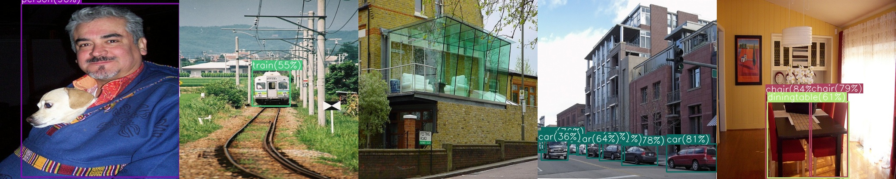

# <div align="center">YOLOv3</div>

---

## [Content]
1. [Description](#description)   
2. [Usage](#usage)  
2-1. [K-medoids Anchor Clustering](#k-medoids-anchor-clustering)  
2-2. [Model Training](#model-training)  
2-3. [Detection Evaluation](#detection-evaluation)  
2-4. [Result Analysis](#result-analysis)  
3. [Contact](#contact)   

---

## [Description]

This is a repository for PyTorch implementation of YOLOv3 following the original paper (https://arxiv.org/abs/1804.02767).   

 - **Performance Table**

| Model | Dataset | Train | Valid | Size<br><sup>(pixel) | mAP<br><sup>(@0.5:0.95) | mAP<br><sup>(@0.5) | Params<br><sup>(M) | FLOPs<br><sup>(B) |
| :---: | :---: | :---: | :---: | :---: | :---: | :---: | :---: | :---: | 
| YOLOv3<br><sup>(<u>Paper:page_with_curl:</u>)</br> | COCO | train2017 | val2017 | 416 | 31.0 | 55.3 | 61.95 | 65.86 |
| YOLOv3<br><sup>(<u>Our:star:</u>)</br> | COCO | train2017 | val2017 | 416 | 33.9 | 54.9 | 61.98 | 66.17 |
| YOLOv3<br><sup>(<u>Our:star:</u>)</br> | PASCAL-VOC | trainval2007+2012 | test2007 | 416 | 43.2 | 80.0 | 61.63 | 65.74 |


 - **Pretrained Model Weights Download**

	- [DarkNet-53 Backbone](https://drive.google.com/file/d/1duXcafb2QgORHDO1w-7E1UusLfWInwgA/view?usp=drive_link)
	- [DarkNet-53-tiny Backbone](https://drive.google.com/file/d/13X39tcmNnYghvdBiosma7gsfwCxjsFQx/view?usp=drive_link)





## [Usage]

#### K-medoids Anchor Clustering   
 - You extract anchor box priors from all instances' boxes at first.

 ```python
python kmedoids_anchor.py --exp my_test --data voc.yaml  --n-cluster 9
 ```


```log
2022-11-28 13:00:53 | Avg IOU: 68.97%
2022-11-28 13:00:53 | Boxes:
	[[0.646      0.456     ]
	[0.214      0.5135135 ]
	[0.052      0.08108108]
	[0.126      0.30133334]
	[0.836      0.8613333 ]
	[0.396      0.7147147 ]
	[0.148      0.13333334]
	[0.314      0.28266665]
	[0.066      0.184     ]]
2022-11-28 13:00:53 | Ratios: [0.36, 0.42, 0.42, 0.55, 0.64, 0.97, 1.11, 1.11, 1.42]
```

<div align="center">

  <a href=""></a>

</div>


#### Model Training 
 - You can train your own YOLOv3 model using Darknet-53 with anchor box from above step. If you wanna train YOLOv3 on your dataset from the scratch, add "--scratch" in training command like below.  

```python
python train.py --exp my_test --data voc.yaml --multiscale(optional) --scratch(optional)
```


#### Detection Evaluation
 - You can compute detection metric via mean Average Precision(mAP) with IoU of 0.5, 0.75, 0.5:0.95. I follow the evaluation code with the reference on https://github.com/rafaelpadilla/Object-Detection-Metrics.

```python
python val.py --exp my_test --data voc.yaml --ckpt-name best.pt
```


#### Result Analysis
 - After training is done, you will get the results shown below.

<div align="center">

  <a href=""></a>

</div>


```log
2022-11-26 22:11:13 | YOLOv3 Architecture Info - Params(M): 61.65, FLOPS(B): 65.74
2022-11-26 22:14:32 | [Train-Epoch:001] multipart: 442.6813  obj: 0.5345  noobj: 421.2506  txty: 0.3686  twth: 1.1349  cls: 17.2549  
2022-11-26 22:18:47 | [Train-Epoch:002] multipart: 8.5325  obj: 0.7439  noobj: 0.1363  txty: 0.3173  twth: 0.5397  cls: 3.8199  
2022-11-26 22:24:22 | [Train-Epoch:003] multipart: 7.4975  obj: 0.7797  noobj: 0.2258  txty: 0.3067  twth: 0.4024  cls: 2.6644  
2022-11-26 22:30:01 | [Train-Epoch:004] multipart: 7.1354  obj: 0.7838  noobj: 0.2711  txty: 0.3000  twth: 0.3534  cls: 2.2920  
2022-11-26 22:35:32 | [Train-Epoch:005] multipart: 6.8276  obj: 0.7748  noobj: 0.3078  txty: 0.2902  twth: 0.3096  cls: 2.0461  
2022-11-26 22:41:07 | [Train-Epoch:006] multipart: 6.6838  obj: 0.7763  noobj: 0.3230  txty: 0.2851  twth: 0.2985  cls: 1.8956  
2022-11-26 22:46:43 | [Train-Epoch:007] multipart: 6.5033  obj: 0.7582  noobj: 0.3741  txty: 0.2809  twth: 0.2736  cls: 1.7837  
2022-11-26 22:52:17 | [Train-Epoch:008] multipart: 6.4126  obj: 0.7480  noobj: 0.3909  txty: 0.2741  twth: 0.2778  cls: 1.7296  
2022-11-26 22:57:56 | [Train-Epoch:009] multipart: 6.2144  obj: 0.7327  noobj: 0.4325  txty: 0.2676  twth: 0.2619  cls: 1.5891  
2022-11-26 23:03:32 | [Train-Epoch:010] multipart: 6.0665  obj: 0.7071  noobj: 0.4835  txty: 0.2646  twth: 0.2449  cls: 1.5379  
2022-11-26 23:04:55 | 
	 - Average Precision (AP) @[ IoU=0.50:0.95 | area=   all | maxDets=100 ] = 0.232
	 - Average Precision (AP) @[ IoU=0.50      | area=   all | maxDets=100 ] = 0.476
	 - Average Precision (AP) @[ IoU=0.75      | area=   all | maxDets=100 ] = 0.187
	 - Average Precision (AP) @[ IoU=0.50:0.95 | area= small | maxDets=100 ] = 0.000
	 - Average Precision (AP) @[ IoU=0.50      | area= small | maxDets=100 ] = 0.001
	 - Average Precision (AP) @[ IoU=0.50:0.95 | area=medium | maxDets=100 ] = 0.038
	 - Average Precision (AP) @[ IoU=0.50      | area=medium | maxDets=100 ] = 0.103
	 - Average Precision (AP) @[ IoU=0.50:0.95 | area= large | maxDets=100 ] = 0.287
	 - Average Precision (AP) @[ IoU=0.50      | area= large | maxDets=100 ] = 0.590

                                                ...

2022-11-28 12:44:51 | [Train-Epoch:249] multipart: 2.5484  obj: 0.2838  noobj: 0.7613  txty: 0.1396  twth: 0.0656  cls: 0.1629  
2022-11-28 12:44:52 | [Best mAP at 220]

	 - Average Precision (AP) @[ IoU=0.50:0.95 | area=   all | maxDets=100 ] = 0.549
	 - Average Precision (AP) @[ IoU=0.50      | area=   all | maxDets=100 ] = 0.795
	 - Average Precision (AP) @[ IoU=0.75      | area=   all | maxDets=100 ] = 0.604
	 - Average Precision (AP) @[ IoU=0.50:0.95 | area= small | maxDets=100 ] = 0.159
	 - Average Precision (AP) @[ IoU=0.50      | area= small | maxDets=100 ] = 0.314
	 - Average Precision (AP) @[ IoU=0.50:0.95 | area=medium | maxDets=100 ] = 0.331
	 - Average Precision (AP) @[ IoU=0.50      | area=medium | maxDets=100 ] = 0.563
	 - Average Precision (AP) @[ IoU=0.50:0.95 | area= large | maxDets=100 ] = 0.598
	 - Average Precision (AP) @[ IoU=0.50      | area= large | maxDets=100 ] = 0.822
```


<div align="center">

<a href=""></a> <a href=""></a> <a href=""></a> <a href=""></a>

</div>


---
## [Contact]
- Author: Jiho Park  
- Email: pjh5672.dev@gmail.com  
